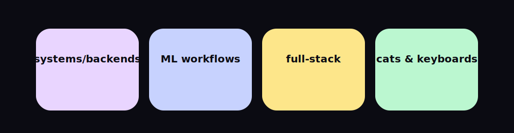

<!-- ——— HERO ——— -->

  

<h1 align="center">hi, i'm nat</h1>

  <a href="mailto:nh2804@columbia.edu">Email</a> ·
  <a href="https://www.linkedin.com/in/natalie-hughes-aa747a222/">LinkedIn</a> ·
  <a href="https://github.com/nh1010?tab=repositories">Repos</a>

---

### Spotlight
- **NYC Cat Tracker** *(in progress)* — interactive Mapbox app visualizing cat spottings across NYC. [[frontend]](https://github.com/nh1010/cat-frontend) · [[backend]](https://github.com/nh1010/cat-backend)
- **Research Citation DApp** — DID + citation-based rewards for researchers. [[repo]](https://github.com/nh1010/Blockchain-Project)
- **Hospital Readmission Risk** — notebook baseline; add metrics + ROC/AUC screenshot. [[repo]](https://github.com/nh1010/Hospital-Readmission-Risk-)
- **Distributed Systems (Go)** — lab implementations; add short bullets per lab. [[repo]](https://github.com/nh1010/Distributed-Systems)
- **Bomberman (Verilog)** — FPGA game logic; embed GIF or schematic. [[repo]](https://github.com/nh1010/Bomberman-)

---

### Gallery

- **NYC Cat Tracker** — interactive Mapbox app visualizing cat spottings across NYC. [[frontend]](https://github.com/nh1010/cat-frontend) · [[backend]](https://github.com/nh1010/cat-backend)
  - borough mask • pastel theme • S3 uploads • Postgres schema
- **Distributed Systems (Go)** — lab implementations; short bullets per lab. [[repo]](https://github.com/nh1010/Distributed-Systems)
  - Raft • RPC • concurrency patterns
- **Citation DApp** — DID + citation-based rewards for researchers. [[repo]](https://github.com/nh1010/Blockchain-Project)
- **Hospital Readmission Risk** — notebook baseline; add metrics + ROC/AUC screenshot. [[repo]](https://github.com/nh1010/Hospital-Readmission-Risk-)

---

### Tech & Tools
`python` · `go` · `typescript` · `react` · `postgres` · `docker` · `mapbox` · `solidity`  
Infra: AWS (RDS, S3, IAM), Prisma/Postgres, Cronitor, Docker Compose

---

### Now
- Shipping **NYC Cat Tracker** v0: Postgres schema, S3 uploads, pastel Mapbox theme
- Tidying **Distributed Systems** notes and lab bullets
- Converting notebook baselines into reproducible **ML pipelines**

<b>Changelog — this week</b>

- cat-backend: add `/spots` pagination + PostGIS index  
- cat-frontend: fix Mapbox style + borough mask overlay  
- ML notebook: export ROC/AUC PNG for README  

