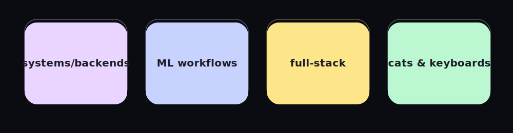

<h1 align="center">hi, i'm nat 👋</h1>

systems/backends • ML workflows • thoughtful UI • cats & keyboards

  <a href="mailto:YOUR@EMAIL">Email</a> ·
  <a href="https://www.linkedin.com/in/YOURHANDLE">LinkedIn</a> ·
  <a href="https://YOUR.SITE">Website</a>

### Spotlight
- **Research Citation DApp** — DID + citation-based rewards for researchers. [[repo]](https://github.com/nh1010/Blockchain-Project)
- **Hospital Readmission Risk** — notebook baseline; add metrics + ROC/AUC screenshot. [[repo]](https://github.com/nh1010/Hospital-Readmission-Risk-)
- **Distributed Systems (Go)** — lab implementations; add short bullets per lab. [[repo]](https://github.com/nh1010/Distributed-Systems)
- **Bomberman (Verilog)** — FPGA game logic; embed GIF or schematic. [[repo]](https://github.com/nh1010/Bomberman-)

### Tech
`python` · `go` · `typescript` · `react` · `postgres` · `docker` · `solidity`
